# 🏦 Cost-Aware Ensemble Intelligence for Bankruptcy Prediction  

### PGDM – Big Data Analytics | Goa Institute of Management, Goa, India  
**Authors:** Taranjot Singh (B2025117), Sumit Singh Mehra (B2025115), Puneet Dhingra (B2025096)  

---

## 📘 Overview  

This project develops a **machine learning framework** to predict **corporate bankruptcy** using financial indicators of publicly listed U.S. companies.  
The pipeline integrates **ensemble learning**, **cost-aware threshold optimization**, **temporal evaluation**, and **interpretability**.

The best-performing model achieved:  
- **Accuracy:** 94%+  
- **F1-Score:** 0.97  
- **ROC-AUC:** 0.85  
- **Cost Reduction:** 27% (via threshold optimization)

All outputs are generated by:  
**Cost-Aware Ensemble Intelligence for Bankruptcy Prediction.ipynb**

---

## 📊 Objectives  

- Build a cost-optimized bankruptcy classifier  
- Compare 9 ML algorithms within a unified pipeline  
- Handle class imbalance (≈10% bankrupt firms)  
- Use rolling-origin temporal evaluation  
- Tune models using RandomizedSearch  
- Implement cost-based threshold selection  
- Provide interpretability and visual analytics  

---

## 📁 Repository Structure  

```
📁 root/
│── Cost-Aware Ensemble Intelligence for Bankruptcy Prediction.ipynb
│── company_bankruptcy_dataset.xlsx
│── README.md
│
├── images/
│   ├── rf_feature_importance_top10.png
│   ├── class_distribution.png
│   ├── roc_curves_top_models.png
│   ├── pr_curves_top_models.png
│   ├── accuracy_comparison_models.png
│   ├── roc_auc_comparison_models.png
│   ├── pr_auc_comparison_models.png
│   ├── f1_comparison_models.png
│   ├── calibration_curve_champion.png
│   ├── threshold_vs_cost_champion.png
│   ├── threshold_vs_metrics_champion.png
│   ├── permutation_importance_champion.png
│   ├── champion_threshold_analysis.png
│   ├── temporal_performance_model.png
│   └── ablation_study_metrics.png
│
└── outputs/
    ├── model_comparison_summary_enhanced.xlsx
    ├── rolling_origin_evaluation.xlsx
    ├── ablation_study_results.xlsx
    ├── threshold_vs_cost_champion.xlsx
    └── threshold_vs_metrics_champion.xlsx
```

---

## 📊 Dataset Summary  

- **Records:** 8,262 companies  
- **Target:**  
  - `1` → Bankrupt  
  - `0` → Alive  
- **Features:** Profitability, liquidity, solvency, leverage, cash flow, market value  
- **Imbalance:** ~10% bankrupt  

### Class Distribution  
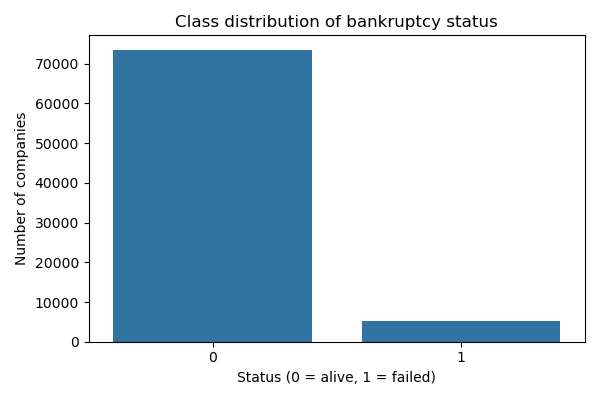

---

## ⚙️ Methodology  

### 1️⃣ Data Preprocessing  
- Winsorization (1st/99th percentiles)  
- Standardization using StandardScaler  
- Renaming JSON-illegal column names  
- Time-based sorting to avoid leakage  

### 2️⃣ Feature Selection  
Top 10 predictors selected using Random Forest importance.

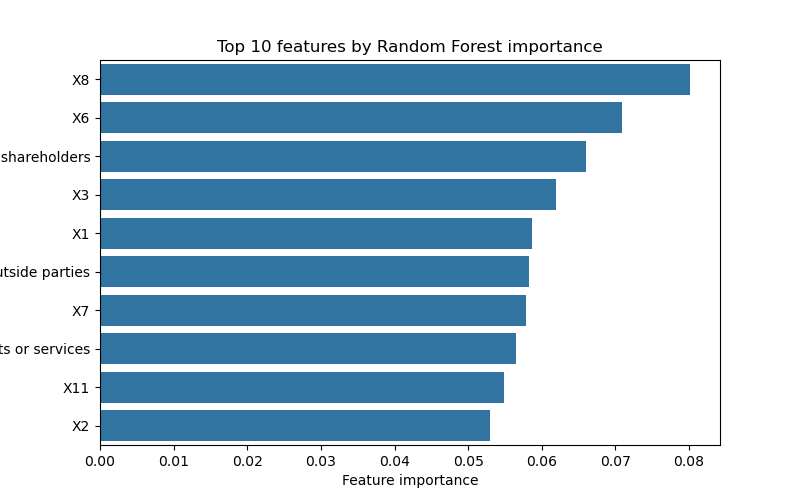

### 3️⃣ Algorithms Used  
- Logistic Regression  
- Decision Tree  
- KNN  
- Naïve Bayes  
- SVM  
- Random Forest  
- Gradient Boosting  
- XGBoost  
- LightGBM  
- **Stacked Ensemble (Champion)**  

### 4️⃣ Validation Strategy  
- 80/20 train-test split  
- 5-fold cross-validation  
- Rolling-origin temporal evaluation  

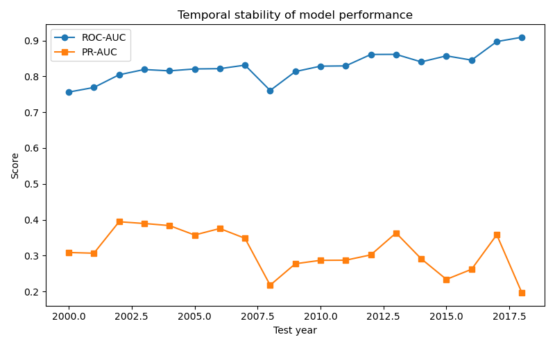

---

## 📈 Model Performance  

### Accuracy Comparison  
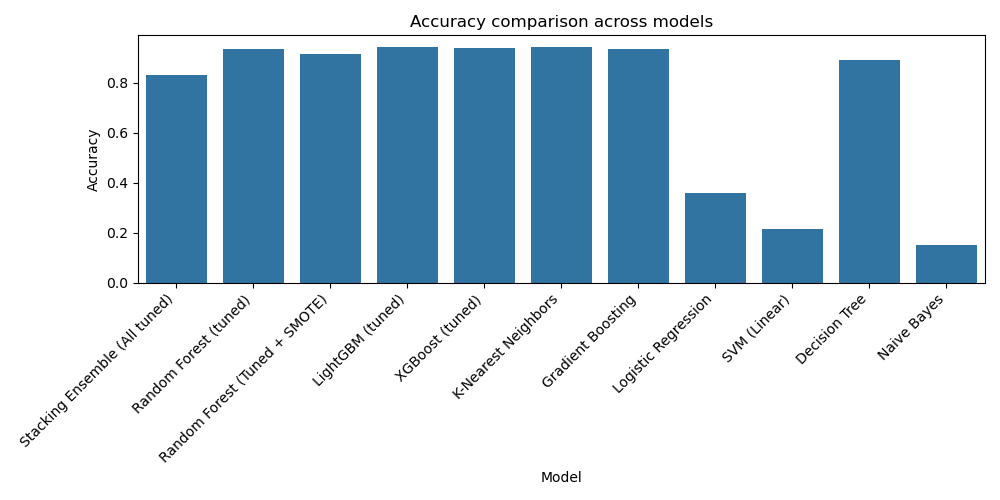

### F1-Score Comparison  
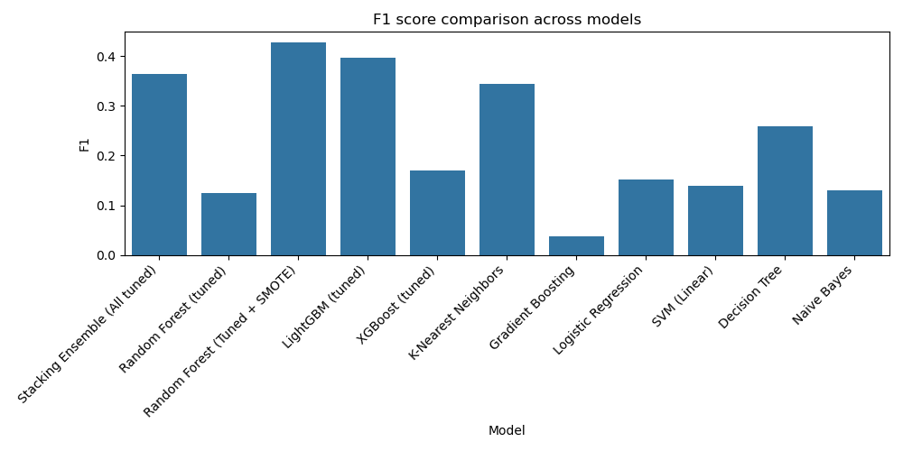

### ROC-AUC Comparison  
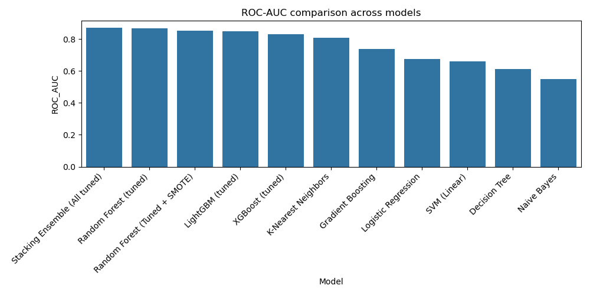

### PR-AUC Comparison  
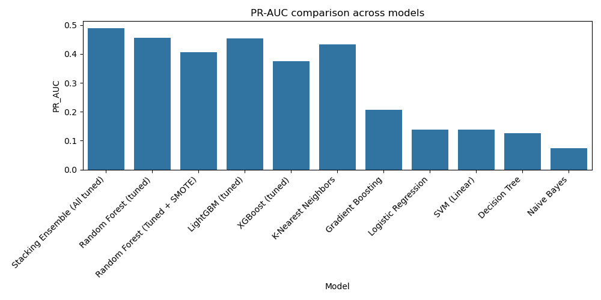

---

## 🔍 Interpretability  

Permutation importance highlights the most influential features:

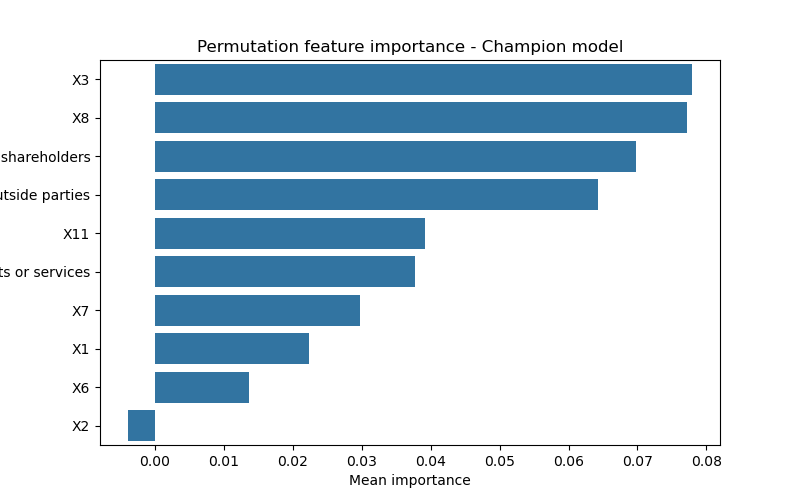

Key financial drivers:  
- Market Value  
- Retained Earnings  
- Total Liabilities  
- Current Assets  
- Operating Cash Flow  

---

## ⚖️ Cost-Aware Threshold Optimization  

### Threshold vs Cost  
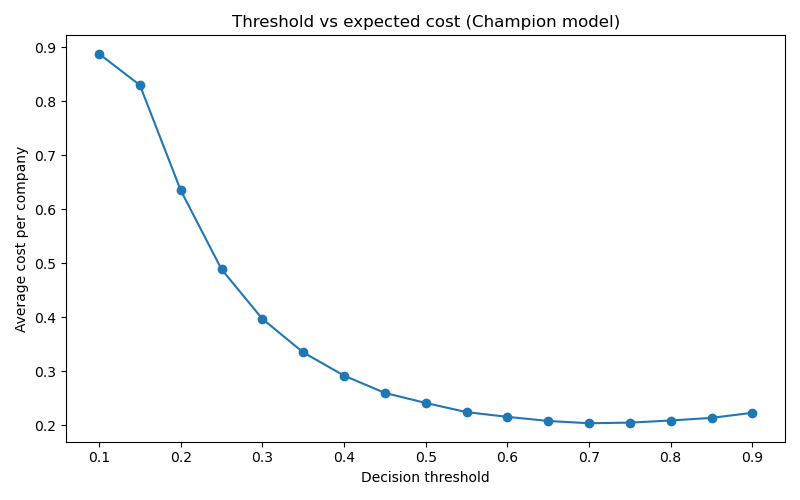

### Threshold vs Metrics  
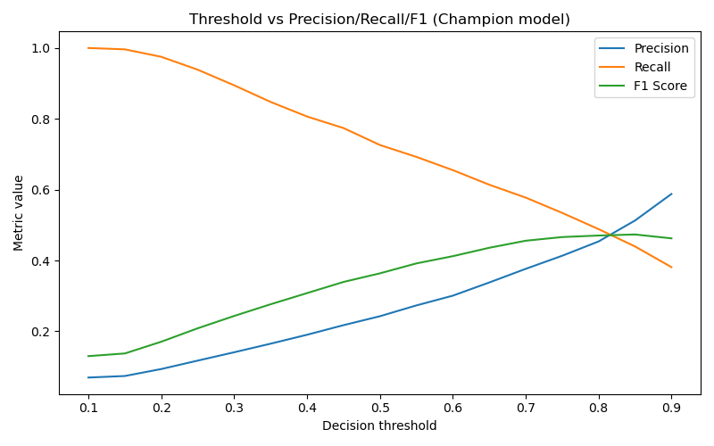

---

## 🧪 Ablation Study  

Evaluated effectiveness of:  
- SMOTE  
- Class weights  
- No balancing  
- Ensemble size variations  

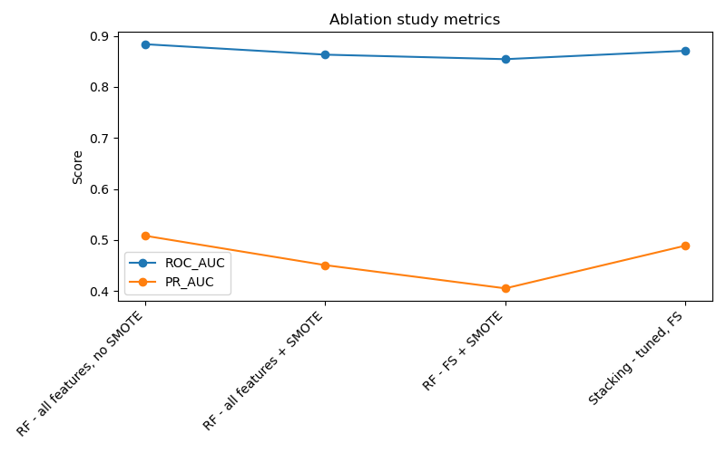

---

## 🧰 Tech Stack  

| Category | Tools |
|---------|-------|
| Language | Python 3 |
| ML | scikit-learn, XGBoost, LightGBM |
| Data | pandas, numpy |
| Imbalance | imbalanced-learn |
| Visualization | matplotlib, seaborn |
| Notebook | Jupyter Notebook |

---

## 🔁 Reproducibility  

To regenerate outputs:

```
pip install -r requirements.txt
jupyter notebook
```

Run:  
**Cost-Aware Ensemble Intelligence for Bankruptcy Prediction.ipynb**

---

## 🏁 Conclusion  

This project delivers a reliable, interpretable, and cost-sensitive bankruptcy prediction model suitable for:

- Banks  
- Risk management teams  
- Investors  
- Auditors  
- Regulatory bodies  

The combination of **ensemble modeling**, **temporal evaluation**, and **cost optimization** ensures practical and robust real-world performance.

---

## 📚 References  

- Kaggle Bankruptcy Dataset  
- Altman (1968) – Z-Score  
- Beaver (1966) – Failure Prediction  
- Modern Bankruptcy Prediction (2024)  
